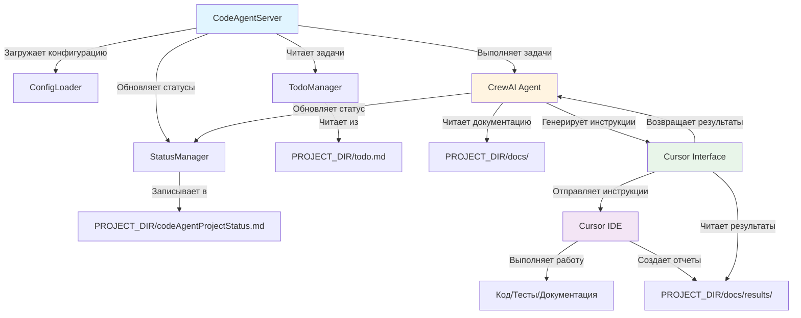
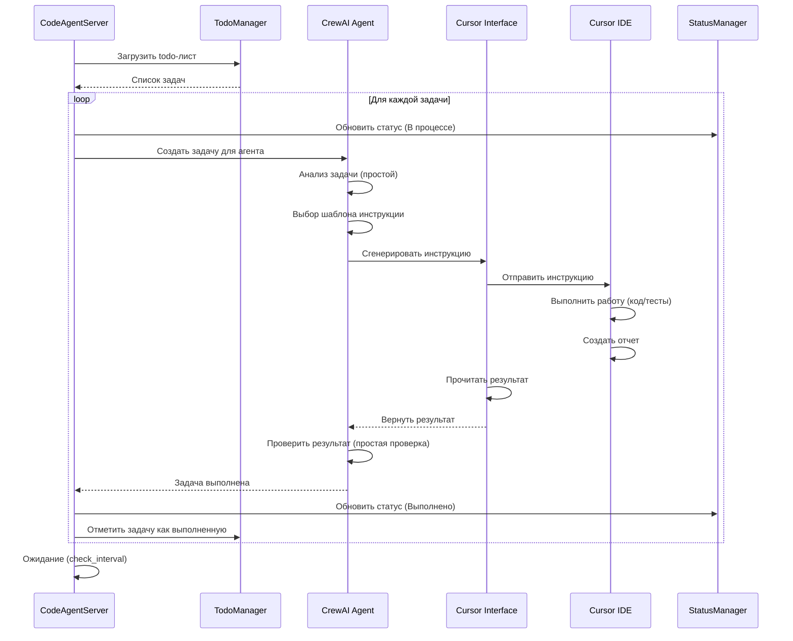
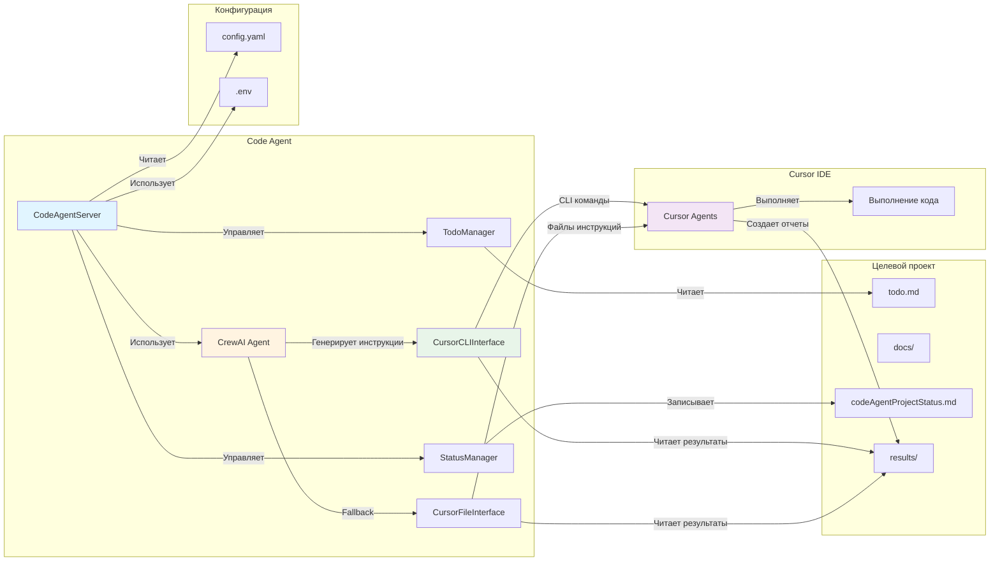
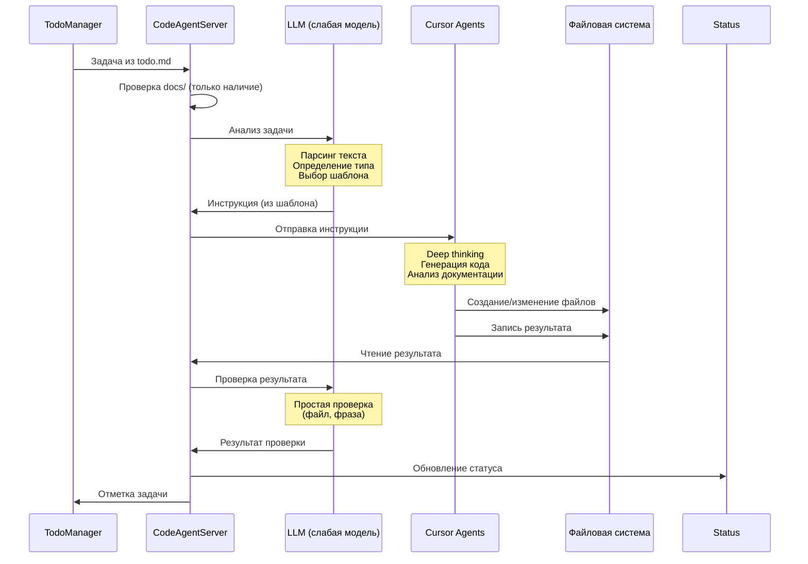

# Архитектура Code Agent

## Обзор

Code Agent - это автоматизированная система на базе фреймворка CrewAI, предназначенная для управления и выполнения задач в проектах разработки. Агент работает в бесконечном цикле, анализирует документацию проекта, читает задачи из todo-листа и выполняет их поэтапно.

## Архитектурные компоненты

### 1. Сервер агента (`src/server.py`)

Основной компонент системы, который:

- Запускает бесконечный цикл работы агента
- Управляет сессиями выполнения задач
- Координирует взаимодействие между компонентами
- Читает конфигурацию из файла настроек

**Основные функции:**
- `start()` - Запуск сервера агента
- `run_iteration()` - Выполнение одной итерации цикла
- `process_project()` - Обработка одного проекта

### 2. Менеджер статусов (`src/status_manager.py`)

Управляет файлом статусов проекта `codeAgentProjectStatus.md`:

- Чтение текущего статуса
- Запись новых статусов
- Обновление существующих записей
- Форматирование статусов в Markdown

**Основные методы:**
- `read_status()` - Чтение текущего статуса
- `write_status()` - Запись нового статуса
- `append_status()` - Добавление статуса в конец файла
- `update_task_status()` - Обновление статуса конкретной задачи

### 3. Менеджер задач (`src/todo_manager.py`)

Читает и управляет todo-листом проекта:

- Парсинг различных форматов todo (txt, yaml, md)
- Извлечение иерархии задач
- Отслеживание выполненных задач
- Подготовка задач для агентов

**Основные методы:**
- `load_todos()` - Загрузка todo из файла
- `get_pending_tasks()` - Получение непройденных задач
- `mark_task_done()` - Отметка задачи как выполненной
- `get_task_hierarchy()` - Получение иерархии задач

### 4. Агенты CrewAI (`src/agents/`)

Определения агентов для выполнения различных типов задач:

**Основной агент исполнителя (`executor_agent.py`):**
- Роль: "Project Executor Agent"
- Цель: Выполнение задач проекта
- Инструменты: CodeInterpreterTool, чтение файлов, запись файлов

**Важно: Ограничения LLM агента Code Agent**

LLM агента Code Agent - это **слабая языковая модель** на базе бесплатных моделей от доступных провайдеров (например, GPT-3.5-turbo, Claude Haiku, локальные модели через Ollama).

**Ограничения и принципы работы:**

- ⚠️ **Нет Deep Thinking**: LLM агента **никогда не делает глубокий анализ или сложные рассуждения**
- ✅ **Только инструкции**: Работает **строго по предопределенным инструкциям** из конфигурации
- ✅ **Простые действия**: Выполняет только **простые осмысленные действия** для понимания контекста задачи
- ✅ **Минимальный контекст**: Анализирует **только текст задачи** из todo-листа, без анализа документации
- ✅ **Генерация инструкций**: Генерирует **простые инструкции/команды** для Cursor, не код

**Примеры допустимых действий LLM:**
- Парсинг текста задачи из todo-листа
- Определение типа задачи (по ключевым словам)
- Выбор шаблона инструкции из конфигурации
- Подстановка значений в шаблон инструкции
- Простая проверка результатов (наличие файла, контрольная фраза)

**Что LLM НЕ делает:**
- ❌ Глубокий анализ архитектуры проекта
- ❌ Сложное планирование выполнения
- ❌ Генерация кода
- ❌ Анализ документации проекта
- ❌ Принятие сложных решений без инструкций

**Специализированные агенты** (для будущего расширения):
- Агент документации
- Агент тестирования
- Агент рефакторинга

### 5. Конфигурация (`config/`)

Файлы конфигурации в формате YAML:

- `config.yaml` - Основные настройки агента
- `agents.yaml` - Определения агентов (опционально)

## Поток данных

### Диаграмма потока данных



### Текстовая диаграмма (альтернатива)

```
┌─────────────────┐
│   Server.py     │  Запуск и управление циклом
└────────┬────────┘
         │
         ├─────────────────┬─────────────────┐
         │                 │                 │
         ▼                 ▼                 ▼
┌─────────────────┐ ┌──────────────┐ ┌──────────────┐
│ TodoManager     │ │StatusManager │ │ CrewAI Agent │
│ - Чтение todo   │ │ - Запись     │ │ - Выполнение │
│ - Парсинг задач │ │   статусов   │ │   задач      │
└────────┬────────┘ └──────────────┘ └──────┬───────┘
         │                                    │
         └────────────────┬───────────────────┘
                          │
                          ▼
                  ┌───────────────┐
                  │   Проект      │
                  │ - docs/       │
                  │ - todo.md     │
                  │ - status.md   │
                  └───────────────┘
```

## Рабочий цикл

### Диаграмма последовательности выполнения задачи



### Описание цикла

1. **Инициализация**
   - Загрузка конфигурации
   - Инициализация менеджеров (todo, status)
   - Создание агентов CrewAI

2. **Основной цикл** (бесконечный):
   ```
   WHILE True:
       - Загрузить todo-лист
       - Получить непройденные задачи
       - FOR каждой задачи:
           - Создать сессию агента
           - Выполнить задачу через CrewAI
           - Обновить статус
           - Отметить задачу как выполненную
       - Ожидание интервала (check_interval)
   ```

3. **Выполнение задачи**:
   - Code Agent получает описание задачи из todo
   - Code Agent проверяет наличие документации (без чтения содержимого)
   - **LLM (слабая модель) анализирует только текст задачи** - выполняет простые действия:
     * Парсинг текста задачи
     * Определение типа задачи по ключевым словам
     * Выбор шаблона инструкции из конфигурации (без deep thinking)
   - **LLM генерирует инструкции/команды для Cursor** - используя предопределенные шаблоны из конфигурации
   - Code Agent отправляет инструкции агентам Cursor через интерфейс
   - Cursor Agents выполняют работу (код, тесты, документация, deep thinking)
   - Code Agent получает результаты из файлов-репортов
   - **LLM проверяет результаты** - простые проверки (наличие файла, контрольная фраза)
   - Результат записывается в status manager
   - Todo manager обновляет статус задачи

## Расположение файлов

### В директории проекта агента (`codeAgent/`):
- Конфигурация агента
- Исходный код агента
- Документация агента

### В директории обрабатываемого проекта (`PROJECT_DIR/`):
- `docs/` - Документация проекта
- `todo.md` - Список задач (формат по умолчанию, также поддерживаются todo.txt, todo.yaml)
- `codeAgentProjectStatus.md` - Статусы выполнения (создается/обновляется агентом)

## Интеграция с Cursor

Code Agent работает как **координатор задач**, взаимодействуя с Cursor IDE через интерфейс пользователя.

### Диаграмма взаимодействия компонентов



### Роли компонентов

- **Code Agent (CrewAI)**: 
  - Читает задачи из todo-листа
  - Планирует выполнение в рамках todo-листа
  - Генерирует команды/инструкции для Cursor (не код!)
  - Контролирует выполнение через файлы-репорты
  - Ведет протокол в `codeAgentProjectStatus.md`

- **Cursor Agents** (очень умные модели последнего поколения):
  - Используют **мощные языковые модели** (GPT-4, Claude Opus, GPT-4 Turbo)
  - **Понимают контекст с полуслова** - не требуют детальных инструкций
  - Получают инструкции от Code Agent
  - Выполняют код и архитектурные задачи (deep thinking)
  - Анализируют документацию проекта (глубокий анализ)
  - Создают планы выполнения
  - **Подробно протоколируют работу** - создают детальные отчеты с полным контекстом
  - Генерируют отчеты о выполнении для Code Agent через файлы-репорты

### Диаграмма последовательности взаимодействия



### Процесс взаимодействия

1. **Code Agent читает задачу** из todo.md
2. **Code Agent проверяет документацию** - только наличие файлов в docs/, не читает содержимое
3. **LLM (слабая модель) анализирует задачу** - простые действия:
   - Парсинг текста задачи из todo-листа
   - Определение типа задачи по ключевым словам
   - Выбор шаблона инструкции из конфигурации (без deep thinking)
4. **LLM генерирует инструкции** - используя предопределенные шаблоны, не создает новые планы
5. **Cursor выполняет работу** - код, тесты, документация, архитектурное планирование выполняются агентами Cursor
6. **Code Agent получает результаты** - текстовые репорты из файлов
7. **LLM проверяет результаты** - простые проверки (наличие файла, контрольная фраза)
8. **Code Agent обновляет статус** - в `codeAgentProjectStatus.md`

**Важно:** LLM Code Agent работает **строго по инструкциям** из конфигурации и не делает глубокий анализ или сложные рассуждения. Вся интеллектуальная работа выполняется агентами Cursor.

Подробнее см. [Интеграция с Cursor](../integration/cursor_integration.md) и [Детальный рабочий процесс](workflow_detailed.md)

## Расширяемость

Архитектура позволяет легко добавлять:

- Новые типы агентов для специализированных задач
- Дополнительные форматы todo-листов
- Интеграции с другими инструментами
- Веб-интерфейс для мониторинга
- API для внешнего управления

## Безопасность

- `allow_code_execution=True` используется с осторожностью
- CodeInterpreterTool должен работать в изолированной среде (Docker/песочница)
- Чтение/запись файлов ограничено директорией проекта
