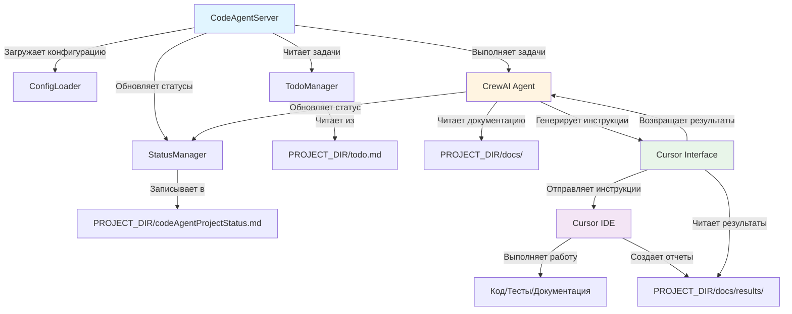
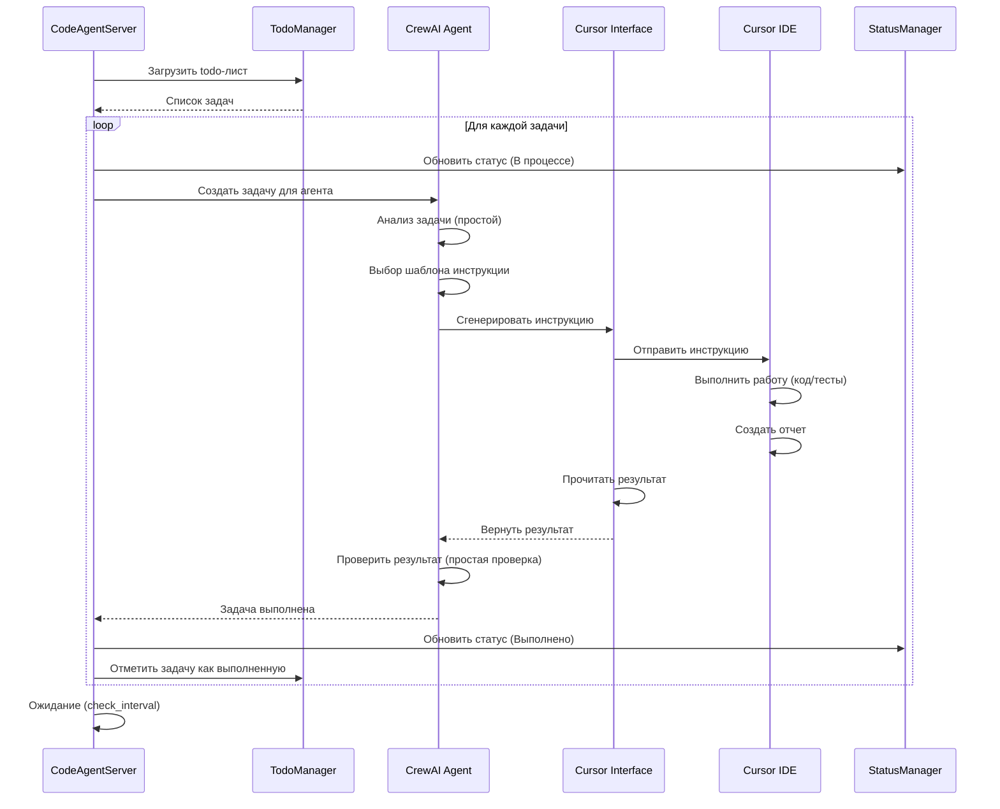
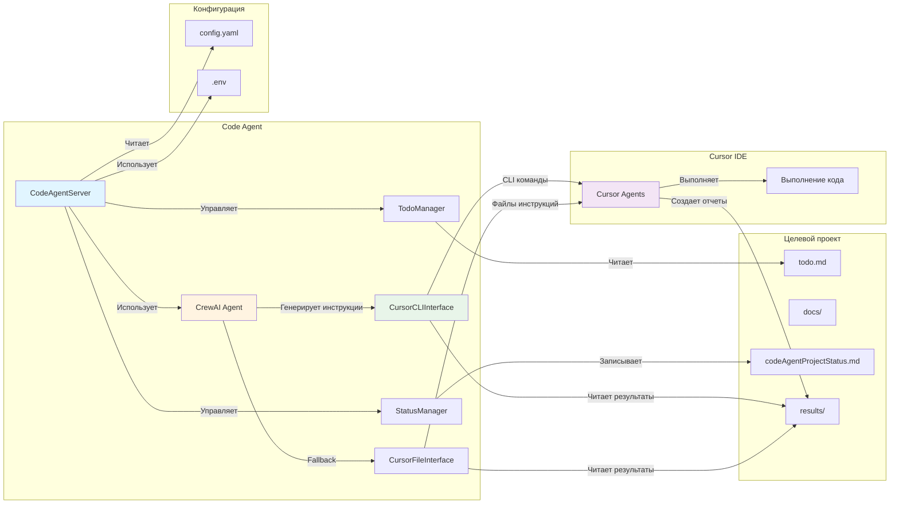
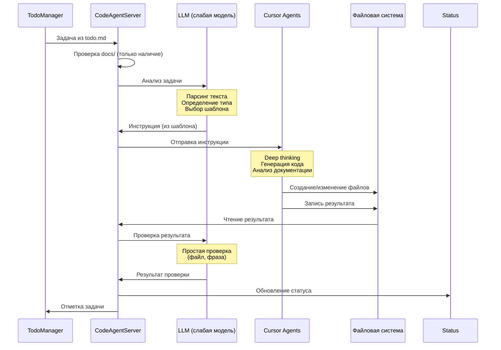
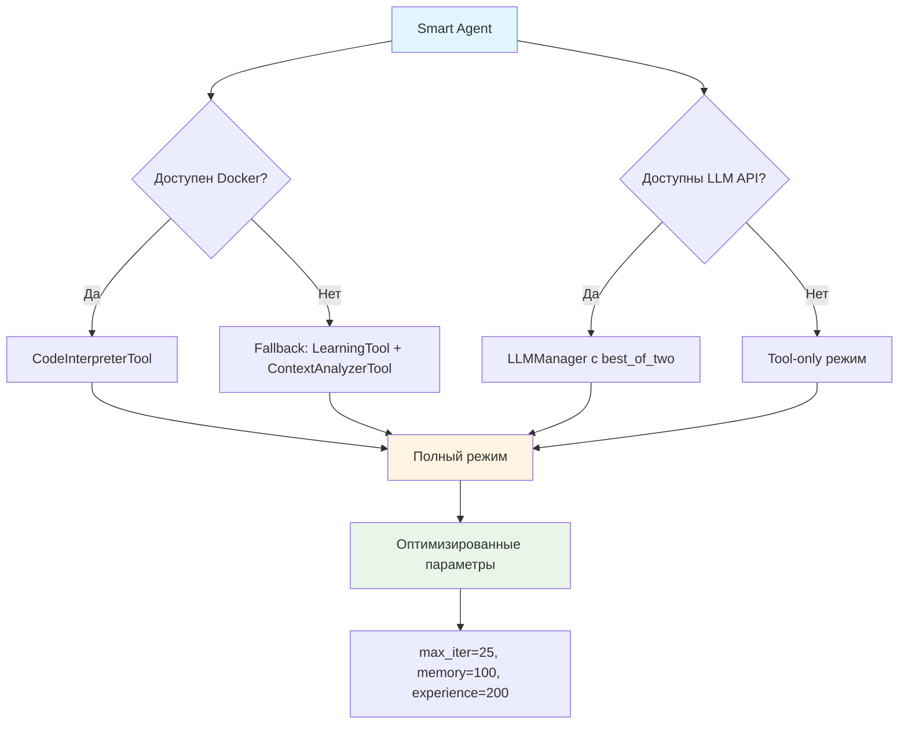

# Архитектура Code Agent

## Обзор

Code Agent - это автоматизированная система на базе фреймворка CrewAI, предназначенная для управления и выполнения задач в проектах разработки. Агент работает в бесконечном цикле, анализирует документацию проекта, читает задачи из todo-листа и выполняет их поэтапно.

## Архитектурные компоненты

### 1. Ядро системы (`src/core/`)

#### 1.1 ServerCore (`src/core/server_core.py`)

**Основной компонент цикла выполнения задач с dependency injection:**

Базовый цикл выполнения, отвечающий за:
- Управление итерациями выполнения
- Синхронизацию задач с checkpoint системой
- Обработку сценариев отсутствия задач (ревизия, генерация TODO)
- Координацию выполнения через внешние обработчики

**Основные методы:**
- `execute_iteration()` - Выполнение полной итерации цикла
- `execute_single_task()` - Выполнение отдельной задачи
- `_handle_no_tasks_scenario()` - Обработка отсутствия задач
- `_sync_todos_with_checkpoint()` - Синхронизация с checkpoint
- `_filter_completed_tasks()` - Фильтрация выполненных задач

**Dependency Injection:**
- Все зависимости инжектируются через конструктор
- Использует интерфейсы для слабой связанности
- Поддерживает автоматическую замену реализаций

**Протоколы зависимостей:**
- `TaskExecutor` - Протокол для выполнения задач
- `RevisionExecutor` - Протокол для ревизии проекта
- `TodoGenerator` - Протокол для генерации TODO

#### 1.2 Абстрактные базовые классы (`src/core/abstract_base.py`)

**Иерархия компонентов:**
- `BaseComponent` - Базовый компонент, наследующий `IServerComponent`
- `ConfigurableComponent` - Конфигурируемый компонент с поддержкой `IConfigurable`
- `MetricsEnabledComponent` - Компонент с поддержкой метрик `IMetricsCollector`

### 1.3 Интерфейсы и Dependency Injection (`src/core/interfaces/`)

**Принципы SOLID и DI:**

Система построена на принципах SOLID и dependency injection для обеспечения:
- **S (Single Responsibility)**: Каждый компонент отвечает за одну задачу
- **O (Open/Closed)**: Компоненты открыты для расширения, закрыты для модификации
- **L (Liskov Substitution)**: Реализации могут заменяться через интерфейсы
- **I (Interface Segregation)**: Разделение интерфейсов по ответственности
- **D (Dependency Inversion)**: Зависимости инжектируются, а не создаются

**Основные интерфейсы:**
- `IManager` - Базовый интерфейс для всех менеджеров
- `ITodoManager` - Управление задачами проекта
- `IStatusManager` - Управление статусами выполнения
- `ICheckpointManager` - Управление контрольными точками
- `ILogger` - Логирование операций

**Dependency Injection контейнер (`src/core/di_container.py`):**
- `DIContainer` - Контейнер для регистрации и разрешения зависимостей
- `ServiceLifetime` - SINGLETON, TRANSIENT, SCOPED
- `create_default_container()` - Фабрика для создания настроенного контейнера

#### 1.3 Интерфейсы (`src/core/interfaces.py`)

**Основные интерфейсы:**
- `IServerComponent` - Базовый интерфейс серверных компонентов
- `IConfigurable` - Интерфейс конфигурируемых компонентов
- `IMetricsCollector` - Интерфейс сборщиков метрик

#### 1.4 Конфигурационный менеджер (`src/core/configuration_manager.py`)

Управление конфигурацией системы с поддержкой:
- Валидации конфигурации
- Горячей перезагрузки настроек
- Типизированного доступа к параметрам

#### 1.5 HTTP сервер (`src/core/http_server.py`)

REST API сервер для:
- Мониторинга состояния агента
- Управления задачами
- Получения метрик производительности

#### 1.6 Сборщик метрик (`src/core/metrics_collector.py`)

Система телеметрии с поддержкой:
- Метрик производительности
- Счетчиков задач
- Времени выполнения операций

#### 1.7 Обработчик ошибок (`src/core/error_handler.py`)

Типизированная система обработки ошибок:
- Классификация ошибок
- Стратегии восстановления
- Логирование исключений

#### 1.8 Наблюдатель файлов (`src/core/file_watcher.py`)

Система отслеживания изменений файлов:
- Мониторинг директорий проекта
- Автоматический перезапуск при изменениях
- Фильтрация событий по типам файлов

#### 1.9 Типы данных (`src/core/types.py`)

Общие типы данных системы:
- Перечисления состояний
- Типы конфигураций
- Структуры данных метрик

### 2. Сервер агента (`src/server.py`)

**Управляющий компонент системы:**

Отвечает за:
- Инициализацию и запуск ServerCore
- Управление жизненным циклом сервера
- HTTP API интерфейс
- Интеграцию с внешними системами (Git, Docker)
- Обработку сигналов остановки и перезапуска

**Основные функции:**
- `start()` - Запуск сервера с инициализацией ServerCore
- `run_iteration()` - Делегирование выполнения ServerCore
- `_create_server_core()` - Создание экземпляра ServerCore с зависимостями
- Автоматическая интеграция с git_utils для push после коммитов

### 2. Менеджер статусов (`src/status_manager.py`)

Управляет файлом статусов проекта `codeAgentProjectStatus.md`:

- Чтение текущего статуса
- Запись новых статусов
- Обновление существующих записей
- Форматирование статусов в Markdown

**Основные методы:**
- `read_status()` - Чтение текущего статуса
- `write_status()` - Запись нового статуса
- `append_status()` - Добавление статуса в конец файла
- `update_task_status()` - Обновление статуса конкретной задачи

### 3. Менеджер задач (`src/todo_manager.py`)

Читает и управляет todo-листом проекта:

- Парсинг различных форматов todo (txt, yaml, md)
- Извлечение иерархии задач
- Отслеживание выполненных задач
- Подготовка задач для агентов

**Основные методы:**
- `load_todos()` - Загрузка todo из файла
- `get_pending_tasks()` - Получение непройденных задач
- `mark_task_done()` - Отметка задачи как выполненной
- `get_task_hierarchy()` - Получение иерархии задач

### 4. Агенты CrewAI (`src/agents/`)

Система поддерживает два типа агентов: базовый **Project Executor Agent** и продвинутый **Smart Agent** с инструментами обучения и анализа контекста.

#### 4.1 Базовый агент исполнителя (`executor_agent.py`)

**Основной агент исполнителя:**
- Роль: "Project Executor Agent"
- Цель: Выполнение задач проекта
- Инструменты: CodeInterpreterTool, чтение файлов, запись файлов

**Важно: Ограничения LLM агента Code Agent**

LLM агента Code Agent - это **слабая языковая модель** на базе бесплатных моделей от доступных провайдеров (например, GPT-3.5-turbo, Claude Haiku, локальные модели через Ollama).

**Ограничения и принципы работы:**

- ⚠️ **Нет Deep Thinking**: LLM агента **никогда не делает глубокий анализ или сложные рассуждения**
- ✅ **Только инструкции**: Работает **строго по предопределенным инструкциям** из конфигурации
- ✅ **Простые действия**: Выполняет только **простые осмысленные действия** для понимания контекста задачи
- ✅ **Минимальный контекст**: Анализирует **только текст задачи** из todo-листа, без анализа документации
- ✅ **Генерация инструкций**: Генерирует **простые инструкции/команды** для Cursor, не код

**Примеры допустимых действий LLM:**
- Парсинг текста задачи из todo-листа
- Определение типа задачи (по ключевым словам)
- Выбор шаблона инструкции из конфигурации
- Подстановка значений в шаблон инструкции
- Простая проверка результатов (наличие файла, контрольная фраза)

**Что LLM НЕ делает:**
- ❌ Глубокий анализ архитектуры проекта
- ❌ Сложное планирование выполнения
- ❌ Генерация кода
- ❌ Анализ документации проекта
- ❌ Принятие сложных решений без инструкций

#### 4.2 Smart Agent (`smart_agent.py`)

**Продвинутый агент с инструментами обучения и анализа:**

**Характеристики:**
- Роль: "Smart Project Executor Agent"
- Цель: Выполнение задач с использованием обучения на предыдущих выполнениях и анализа контекста проекта
- **Backstory**: Агент, который учится на задачах, анализирует проект и использует оптимизированные LLM настройки

**Инструменты Smart Agent:**
- **LearningTool**: Обучение на предыдущих выполнениях задач
- **ContextAnalyzerTool**: Анализ структуры и зависимостей проекта
- **CodeInterpreterTool**: Выполнение кода (опционально, с Docker)
- **Unicode нормализация**: Улучшенный поиск и анализ текста

**Оптимизированные параметры производительности:**
- `max_iter=25` - Увеличено для сложных задач (было 15)
- `memory=100` - Расширена память для длинных сессий (было 50)
- `max_experience_tasks=200` - Больше задач в истории обучения (было 100)
- `verbose=true` - Оптимизировано для production (можно отключать)

**Режимы работы Smart Agent:**

1. **Полный режим (с Docker + LLM)**:
   - Docker контейнеры для безопасного выполнения кода
   - LLM интеграция с best_of_two стратегией
   - Максимальная функциональность

2. **Fallback режим (без Docker)**:
   - Автоматическое переключение при недоступности Docker
   - Работа только с инструментами обучения и анализа
   - Полная функциональность для анализа кода

3. **Tool-only режим**:
   - При отсутствии API ключей для LLM
   - Graceful degradation без потери функциональности

**LLM стратегия best_of_two:**
- Параллельная оценка несколькими моделями
- Критерии качества: relevance, completeness, efficiency
- Автоматический fallback при ошибках
- Поддержка ролей моделей (primary, duplicate, reserve, fallback)

**Специализированные агенты** (для будущего расширения):
- Агент документации
- Агент тестирования
- Агент рефакторинга

### 5. Конфигурация (`config/`)

Файлы конфигурации в формате YAML:

- `config.yaml` - Основные настройки агента
- `agents.yaml` - Определения агентов (опционально)

## Поток данных

### Диаграмма потока данных



### Текстовая диаграмма (альтернатива)

```
┌─────────────────┐
│   Server.py     │  Запуск и управление циклом
└────────┬────────┘
         │
         ├─────────────────┬─────────────────┐
         │                 │                 │
         ▼                 ▼                 ▼
┌─────────────────┐ ┌──────────────┐ ┌──────────────┐
│ TodoManager     │ │StatusManager │ │ CrewAI Agent │
│ - Чтение todo   │ │ - Запись     │ │ - Выполнение │
│ - Парсинг задач │ │   статусов   │ │   задач      │
└────────┬────────┘ └──────────────┘ └──────┬───────┘
         │                                    │
         └────────────────┬───────────────────┘
                          │
                          ▼
                  ┌───────────────┐
                  │   Проект      │
                  │ - docs/       │
                  │ - todo.md     │
                  │ - status.md   │
                  └───────────────┘
```

## Рабочий цикл

### Диаграмма последовательности выполнения задачи



### Описание цикла

1. **Инициализация**
   - Загрузка конфигурации
   - Инициализация менеджеров (todo, status)
   - Создание агентов CrewAI

2. **Основной цикл** (бесконечный):
   ```
   WHILE True:
       - Загрузить todo-лист
       - Получить непройденные задачи
       - FOR каждой задачи:
           - Создать сессию агента
           - Выполнить задачу через CrewAI
           - Обновить статус
           - Отметить задачу как выполненную
       - Ожидание интервала (check_interval)
   ```

3. **Выполнение задачи**:
   - Code Agent получает описание задачи из todo
   - Code Agent проверяет наличие документации (без чтения содержимого)
   - **LLM (слабая модель) анализирует только текст задачи** - выполняет простые действия:
     * Парсинг текста задачи
     * Определение типа задачи по ключевым словам
     * Выбор шаблона инструкции из конфигурации (без deep thinking)
   - **LLM генерирует инструкции/команды для Cursor** - используя предопределенные шаблоны из конфигурации
   - Code Agent отправляет инструкции агентам Cursor через интерфейс
   - Cursor Agents выполняют работу (код, тесты, документация, deep thinking)
   - Code Agent получает результаты из файлов-репортов
   - **LLM проверяет результаты** - простые проверки (наличие файла, контрольная фраза)
   - Результат записывается в status manager
   - Todo manager обновляет статус задачи

## Расположение файлов

### В директории проекта агента (`codeAgent/`):
- Конфигурация агента
- Исходный код агента
- Документация агента

### В директории обрабатываемого проекта (`PROJECT_DIR/`):
- `docs/` - Документация проекта
- `todo.md` - Список задач (формат по умолчанию, также поддерживаются todo.txt, todo.yaml)
- `codeAgentProjectStatus.md` - Статусы выполнения (создается/обновляется агентом)

## Интеграция с Cursor

Code Agent работает как **координатор задач**, взаимодействуя с Cursor IDE через интерфейс пользователя.

### Диаграмма взаимодействия компонентов



### Роли компонентов

- **Code Agent (CrewAI)**: 
  - Читает задачи из todo-листа
  - Планирует выполнение в рамках todo-листа
  - Генерирует команды/инструкции для Cursor (не код!)
  - Контролирует выполнение через файлы-репорты
  - Ведет протокол в `codeAgentProjectStatus.md`

- **Cursor Agents** (очень умные модели последнего поколения):
  - Используют **мощные языковые модели** (GPT-4, Claude Opus, GPT-4 Turbo)
  - **Понимают контекст с полуслова** - не требуют детальных инструкций
  - Получают инструкции от Code Agent
  - Выполняют код и архитектурные задачи (deep thinking)
  - Анализируют документацию проекта (глубокий анализ)
  - Создают планы выполнения
  - **Подробно протоколируют работу** - создают детальные отчеты с полным контекстом
  - Генерируют отчеты о выполнении для Code Agent через файлы-репорты

### Диаграмма последовательности взаимодействия



### Процесс взаимодействия

1. **Code Agent читает задачу** из todo.md
2. **Code Agent проверяет документацию** - только наличие файлов в docs/, не читает содержимое
3. **LLM (слабая модель) анализирует задачу** - простые действия:
   - Парсинг текста задачи из todo-листа
   - Определение типа задачи по ключевым словам
   - Выбор шаблона инструкции из конфигурации (без deep thinking)
4. **LLM генерирует инструкции** - используя предопределенные шаблоны, не создает новые планы
5. **Cursor выполняет работу** - код, тесты, документация, архитектурное планирование выполняются агентами Cursor
6. **Code Agent получает результаты** - текстовые репорты из файлов
7. **LLM проверяет результаты** - простые проверки (наличие файла, контрольная фраза)
8. **Code Agent обновляет статус** - в `codeAgentProjectStatus.md`

**Важно:** LLM Code Agent работает **строго по инструкциям** из конфигурации и не делает глубокий анализ или сложные рассуждения. Вся интеллектуальная работа выполняется агентами Cursor.

Подробнее см. [Интеграция с Cursor](../integration/cursor_integration.md) и [Детальный рабочий процесс](workflow_detailed.md)

## Git интеграция

### Автоматический push после коммитов

Система включает интеграцию с Git для автоматической отправки коммитов в удаленный репозиторий:

- **Триггер:** После успешного выполнения инструкции 8 (Коммит и отправка)
- **Проверки:**
  - Существование последнего коммита
  - Разрешение текущей ветки для авто-push
  - Наличие неотправленных коммитов
- **Действия:** Выполнение `git push origin <branch>` с таймаутом
- **Логирование:** Подробная информация о каждом шаге

### Контроль разрешений веток

Для обеспечения безопасности реализован контроль разрешений веток:

- **По умолчанию:** Только ветка `smart` разрешена для авто-push
- **Настройка:** Список разрешенных веток в `config/config.yaml`
- **Безопасность:** Предотвращает автоматические push в основные ветки (`main`, `master`)

### Компоненты Git интеграции

- **`src/git_utils.py`** - Утилиты для работы с Git командами
- **`src/server.py`** - Интеграция автоматического push в основной цикл
- **Конфигурация** - Настройки в `config/config.yaml` (секция `smart_git`)

## SOLID принципы и Dependency Injection

### Реализация SOLID принципов

**1. Single Responsibility Principle (SRP)**
- Каждый компонент отвечает только за одну задачу
- ServerCore управляет только циклом выполнения
- TodoManager только управляет задачами
- StatusManager только управляет статусами

**2. Open/Closed Principle (OCP)**
- Компоненты открыты для расширения через интерфейсы
- Новые реализации менеджеров могут быть добавлены без изменения существующего кода
- DI контейнер позволяет легко заменять реализации

**3. Liskov Substitution Principle (LSP)**
- Все реализации интерфейсов могут быть заменены друг на друга
- ServerCore работает с любыми реализациями ITodoManager, IStatusManager и т.д.

**4. Interface Segregation Principle (ISP)**
- Интерфейсы разделены по ответственности
- IManager содержит только общие методы
- Специализированные интерфейсы (ITodoManager, IStatusManager) содержат только нужные методы

**5. Dependency Inversion Principle (DIP)**
- Высокоуровневые модули не зависят от низкоуровневых
- Все зависимости инжектируются через конструкторы
- Используются абстракции (интерфейсы), а не конкретные реализации

### Dependency Injection контейнер

**Возможности:**
- Регистрация сервисов с различными жизненными циклами
- Автоматическое разрешение зависимостей
- Поддержка фабричных функций
- Обнаружение циклических зависимостей
- Управление жизненным циклом компонентов

**Преимущества:**
- Слабая связанность компонентов
- Легкое тестирование с mock объектами
- Гибкая конфигурация системы
- Возможность замены реализаций без изменения кода

### Тестирование

**Модульные тесты (`test/test_di_solid.py`):**
- Тесты DI контейнера и его функциональности
- Тесты интерфейсных контрактов
- Тесты SOLID принципов
- Интеграционные тесты взаимодействия компонентов

**Принципы тестирования:**
- Все компоненты тестируются изолированно через интерфейсы
- Используются mock объекты для зависимостей
- Тесты проверяют контракты интерфейсов
- Интеграционные тесты проверяют совместную работу

## Расширяемость

Архитектура позволяет легко добавлять:

- Новые типы агентов для специализированных задач
- Дополнительные форматы todo-листов
- Интеграции с другими инструментами
- Веб-интерфейс для мониторинга
- API для внешнего управления
- Новые реализации интерфейсов без изменения существующего кода

## Smart Agent архитектура

### Компоненты Smart Agent

#### LearningTool
**Инструмент обучения на опыте:**
- Хранит историю выполнения задач в `smart_experience/`
- Анализирует успешные паттерны решения задач
- Предоставляет рекомендации на основе предыдущего опыта
- Максимальное количество задач: `max_experience_tasks=200`

**Структура опыта:**
```json
{
  "task_type": "documentation_update",
  "success_patterns": ["check_dependencies", "update_links", "validate_structure"],
  "common_issues": ["broken_links", "outdated_examples"],
  "recommendations": ["use_check_doc_links_script", "validate_examples"]
}
```

#### ContextAnalyzerTool
**Инструмент анализа контекста проекта:**
- Анализирует структуру проекта и зависимости
- Unicode нормализация для улучшенного поиска
- Case-insensitive поиск с поддержкой различных языков
- Поиск связей между компонентами проекта

**Функции анализа:**
- `normalize_unicode_text()` - Unicode нормализация текста
- `find_related_files()` - Поиск связанных файлов
- `analyze_dependencies()` - Анализ зависимостей
- `suggest_improvements()` - Рекомендации по улучшению

#### Docker интеграция
**Безопасное выполнение кода:**
- Автоматическое определение доступности Docker
- Fallback режим при недоступности Docker
- CodeInterpreterTool в изолированных контейнерах
- Docker utils: DockerChecker, DockerManager

#### LLM интеграция
**Многоуровневая система LLM:**
- **OpenRouter**: Продвинутые модели (Claude-3.5, GPT-4o, WizardLM)
- **LLMManager**: Автоматический выбор с best_of_two стратегией
- **Graceful degradation**: Tool-only режим при отсутствии API ключей

**Best_of_two стратегия:**
- Параллельная оценка задачами
- Критерии: quality, relevance, completeness, efficiency
- Автоматический выбор лучшей модели
- Fallback цепочка при ошибках

**Детальное описание best_of_two стратегии:** См. [docs/integration/best_of_two_strategy.md](../integration/best_of_two_strategy.md)

### Диаграмма Smart Agent



### Производительность и оптимизация

**Параметры производительности Smart Agent:**

| Параметр | Значение | Эффект |
|----------|----------|--------|
| `max_iter` | 25 | Лучше справляется со сложными задачами |
| `memory` | 100 | Увеличивает контекст для длинных сессий |
| `max_experience_tasks` | 200 | Больше опыта для обучения |
| `verbose` | Оптимизирован | Можно отключать в production |

**Подробный анализ оптимизации:** См. [docs/planning/parameter_optimization_analysis.md](../planning/parameter_optimization_analysis.md)

**Оптимизация verbose режима:**
- Подробное логирование для отладки
- Возможность отключения в production средах
- Автоматическая настройка в зависимости от окружения

### Режимы работы и fallback

#### 1. Полный режим (рекомендуемый)
- Docker + LLM + все инструменты
- Максимальная функциональность и безопасность
- Автоматическое определение доступности компонентов

#### 2. Docker-only режим
- Docker без LLM (при отсутствии API ключей)
- CodeInterpreterTool + LearningTool + ContextAnalyzerTool
- Безопасное выполнение кода без внешних зависимостей

#### 3. LLM-only режим
- LLM без Docker (при недоступности Docker)
- LearningTool + ContextAnalyzerTool + LLM интеграция
- Аналитическая мощность без code execution

#### 4. Tool-only режим (graceful degradation)
- Только инструменты обучения и анализа
- Максимальная стабильность и минимальные зависимости
- Полная функциональность для анализа и рекомендаций

**Подробности миграции и настройки:** См. [docs/guides/migration_guide.md](../guides/migration_guide.md)

### Безопасность Smart Agent

**Уровни безопасности:**
- **Docker изоляция**: Код выполняется в контейнерах
- **API ключи**: Защищенное хранение и использование
- **Файловые разрешения**: Строгие ограничения на чтение/запись
- **Fallback механизмы**: Продолжение работы при сбоях компонентов

**Контроль разрешений:**
- Ограничение команд Shell через whitelist/blacklist
- Паттерны для безопасного доступа к файлам
- Автоматическая валидация путей и команд

## Безопасность

- `allow_code_execution=True` используется с осторожностью
- CodeInterpreterTool должен работать в изолированной среде (Docker/песочница)
- Чтение/запись файлов ограничено директорией проекта
- Smart Agent добавляет дополнительные уровни безопасности через Docker и LLM fallback
