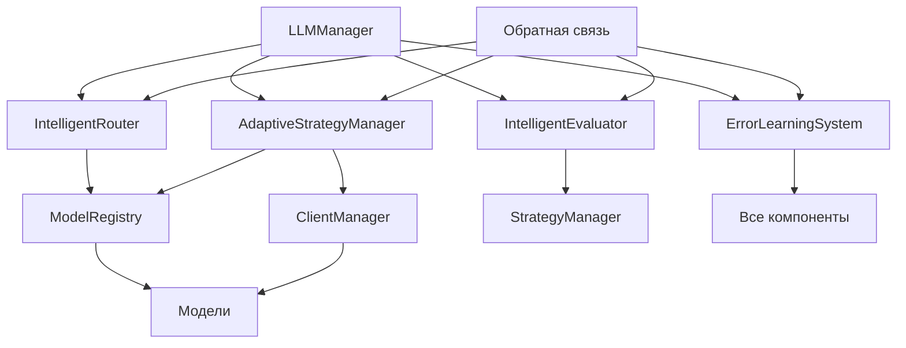

# Интеллектуальные компоненты LLM модуля

## Обзор

Интеллектуальная система интеграции LLM провайдеров представляет собой набор специализированных компонентов, обеспечивающих адаптивное, надежное и эффективное взаимодействие с языковыми моделями.

## Архитектурные принципы

### 1. Адаптивность
- Автоматическое переключение стратегий на основе контекста
- Обучение на исторических данных
- Адаптация к паттернам использования

### 2. Интеллектуальность
- Анализ и классификация запросов
- Многофакторная оценка качества
- Proactive предотвращение ошибок

### 3. Надежность
- Многоуровневая обработка ошибок
- Fallback стратегии
- Автоматическое восстановление

## Компоненты системы

### IntelligentRouter (Интеллектуальный роутер)

#### Назначение
Автоматический анализ запросов и выбор оптимальных моделей для их выполнения.

#### Функциональность

##### Анализ запросов
```python
@dataclass
class RequestAnalysis:
    task_type: TaskType                    # Тип задачи
    complexity: ComplexityLevel           # Уровень сложности
    estimated_tokens: int                 # Прогноз токенов
    requires_accuracy: bool               # Требуется точность
    requires_creativity: bool             # Требуется креативность
    requires_speed: bool                  # Требуется скорость
    is_structured: bool                   # Структурированный вывод
    keywords: Set[str]                    # Ключевые слова
    confidence: float                     # Уверенность анализа
```

##### Поддерживаемые типы задач
- `CODE_GENERATION` - Генерация кода
- `CODE_REVIEW` - Ревью кода
- `ANALYSIS` - Анализ данных
- `QUESTION_ANSWERING` - Ответы на вопросы
- `SUMMARIZATION` - Суммаризация
- `JSON_GENERATION` - Генерация JSON
- `MATH_PROBLEM` - Математические задачи
- `CREATIVE_WRITING` - Творческое письмо
- `TECHNICAL_WRITING` - Техническая документация
- `CHAT_CONVERSATION` - Общий чат
- `TRANSLATION` - Перевод
- `LOGIC_REASONING` - Логическое мышление

##### Алгоритм маршрутизации
1. **Анализ текста запроса** - определение типа задачи и характеристик
2. **Оценка сложности** - анализ длины, сложности слов, технических терминов
3. **Проверка исторической производительности** - выбор модели с лучшими показателями
4. **Выбор стратегии** - single/parallel/fallback на основе требований
5. **Формирование решения** - выбор модели с обоснованием

#### Преимущества
- **Автоматизация выбора** - нет необходимости ручной настройки
- **Обучение** - улучшение качества выбора со временем
- **Гибкость** - поддержка различных типов задач и требований

### AdaptiveStrategyManager (Адаптивный менеджер стратегий)

#### Назначение
Динамическое управление стратегиями генерации с адаптацией к условиям выполнения.

#### Стратегии генерации

##### Single Strategy
```python
# Быстрая генерация через одну модель
response = await client_manager.call_model(selected_model, prompt)
```

##### Parallel Strategy (Best-of-Two)
```python
# Одновременная генерация через две модели
responses = await asyncio.gather(
    client_manager.call_model(model1, prompt),
    client_manager.call_model(model2, prompt)
)
best_response = evaluator.compare_and_select(responses)
```

##### Fallback Strategy
```python
# Последовательное переключение при ошибках
for model in fallback_chain:
    try:
        response = await client_manager.call_model(model, prompt)
        if response.success:
            return response
    except Exception as e:
        logger.warning(f"Model {model.name} failed: {e}")
        continue
```

##### Consensus Strategy
```python
# Голосование нескольких моделей
responses = await get_multiple_responses(models)
consensus_result = evaluator.find_consensus(responses)
```

#### Механизмы адаптации

##### Триггеры адаптации
- `LOW_SUCCESS_RATE` - низкая успешность выполнения
- `HIGH_LATENCY` - высокая задержка ответов
- `LOW_QUALITY` - низкое качество ответов
- `TASK_TYPE_CHANGE` - изменение типа задач
- `ERROR_PATTERN` - выявление паттернов ошибок
- `PERFORMANCE_DEGRADATION` - снижение производительности

##### Адаптивная логика
```python
def adapt_strategy(self, context: AdaptationContext) -> StrategyDecision:
    # Анализ текущей производительности
    current_performance = self._analyze_performance(context)

    # Поиск лучших альтернатив
    alternatives = self._find_better_strategies(context)

    # Выбор оптимальной стратегии
    best_strategy = self._select_optimal_strategy(alternatives, context)

    return StrategyDecision(
        strategy=best_strategy.strategy,
        confidence=best_strategy.confidence,
        reasoning=best_strategy.reasoning,
        expected_score=best_strategy.expected_score,
        expected_latency=best_strategy.expected_latency,
        alternatives=[s.strategy for s in alternatives]
    )
```

### IntelligentEvaluator (Интеллектуальный оценщик)

#### Назначение
Комплексная оценка качества ответов LLM с учетом множества факторов.

#### Аспекты качества оценки

##### Основные аспекты
- **Accuracy** - Точность и корректность информации
- **Completeness** - Полнота ответа на запрос
- **Relevance** - Релевантность запросу
- **Clarity** - Ясность и понятность изложения
- **Structure** - Структура и организация ответа
- **Creativity** - Креативность (для творческих задач)
- **Technical Accuracy** - Техническая точность
- **Safety** - Безопасность и этичность
- **Efficiency** - Эффективность решения

##### Детальная оценка
```python
@dataclass
class DetailedEvaluation:
    overall_score: float                           # Общий балл (0-1)
    aspect_scores: Dict[QualityAspect, float]      # Баллы по аспектам
    confidence: float                              # Уверенность оценки
    method_used: EvaluationMethod                  # Использованный метод
    reasoning: str                                # Обоснование оценки
    issues_detected: List[str]                    # Выявленные проблемы
    strengths: List[str]                          # Сильные стороны
    recommendations: List[str]                    # Рекомендации
    metadata: Dict[str, Any]                      # Дополнительные данные
```

#### Методы оценки

##### Rule-based оценка
```python
def evaluate_by_rules(self, response: str, context: EvaluationContext) -> float:
    score = 0.0
    total_weight = 0.0

    for pattern in self.evaluation_patterns:
        matches = self._count_pattern_matches(response, pattern)
        weighted_score = matches * pattern.weight
        score += weighted_score
        total_weight += pattern.weight

    return score / total_weight if total_weight > 0 else 0.5
```

##### LLM-based оценка
```python
async def evaluate_by_llm(self, response: str, context: EvaluationContext) -> DetailedEvaluation:
    evaluation_prompt = self._build_evaluation_prompt(response, context)

    evaluation_response = await self.evaluator_model.generate(evaluation_prompt)

    return self._parse_evaluation_response(evaluation_response)
```

##### Hybrid оценка
```python
def evaluate_hybrid(self, response: str, context: EvaluationContext) -> DetailedEvaluation:
    # Rule-based оценка
    rule_score = self.evaluate_by_rules(response, context)

    # LLM-based оценка
    llm_evaluation = await self.evaluate_by_llm(response, context)

    # Комбинирование результатов
    combined_score = self._combine_scores(rule_score, llm_evaluation.overall_score)

    return DetailedEvaluation(
        overall_score=combined_score,
        aspect_scores=llm_evaluation.aspect_scores,
        confidence=max(rule_confidence, llm_evaluation.confidence),
        method_used=EvaluationMethod.HYBRID,
        reasoning=f"Rule-based: {rule_score:.2f}, LLM-based: {llm_evaluation.overall_score:.2f}",
        issues_detected=llm_evaluation.issues_detected,
        strengths=llm_evaluation.strengths,
        recommendations=llm_evaluation.recommendations
    )
```

### ErrorLearningSystem (Система обучения на ошибках)

#### Назначение
Анализ ошибок и автоматическое улучшение системы для предотвращения повторений.

#### Типы ошибок

##### Классификация ошибок
- `API_ERROR` - Ошибки API провайдера
- `TIMEOUT_ERROR` - Превышение времени ожидания
- `RATE_LIMIT_ERROR` - Превышение лимитов запросов
- `CONTENT_POLICY_ERROR` - Нарушение политики контента
- `INVALID_RESPONSE` - Невалидный формат ответа
- `LOW_QUALITY` - Низкое качество ответа
- `HALLUCINATION` - Галлюцинации модели
- `INCOMPLETE_RESPONSE` - Неполный ответ
- `IRRELEVANT_RESPONSE` - Нерелевантный ответ
- `FORMATTING_ERROR` - Ошибки форматирования
- `NETWORK_ERROR` - Сетевые проблемы

##### Анализ ошибок
```python
@dataclass
class ErrorAnalysis:
    error_type: ErrorType
    error_pattern: Optional[ErrorPattern]
    severity: float                    # Важность ошибки (0-1)
    confidence: float                  # Уверенность анализа
    root_cause: str                    # Коренная причина
    suggested_fix: str                 # Предлагаемое исправление
    prevention_measures: List[str]     # Меры предотвращения
    metadata: Dict[str, Any]           # Дополнительная информация
```

#### Паттерны ошибок

##### Распознаваемые паттерны
- `MODEL_OVERLOAD` - Перегрузка модели
- `CONTEXT_TOO_LONG` - Слишком длинный контекст
- `COMPLEX_QUERY` - Слишком сложный запрос
- `UNSUPPORTED_FORMAT` - Неподдерживаемый формат
- `SENSITIVE_CONTENT` - Чувствительный контент
- `AMBIGUOUS_REQUEST` - Неоднозначный запрос
- `RESOURCE_EXHAUSTED` - Исчерпание ресурсов

##### Обработка паттернов
```python
async def process_error(self, error_record: ErrorRecord) -> List[LearningInsight]:
    # Анализ ошибки
    analysis = await self._analyze_error(error_record)

    # Обновление статистики
    self._update_error_statistics(analysis)

    # Генерация инсайтов
    insights = await self._generate_insights(analysis, error_record)

    # Применение улучшений
    await self._apply_improvements(insights)

    return insights
```

#### Механизмы обучения

##### Статистический анализ
```python
def update_error_statistics(self, analysis: ErrorAnalysis):
    # Обновление счетчиков ошибок
    self.error_counts[analysis.error_type] += 1

    # Анализ паттернов
    if analysis.error_pattern:
        pattern_stats = self.pattern_stats[analysis.error_pattern]
        pattern_stats.occurrences += 1
        pattern_stats.last_occurrence = datetime.now()
        pattern_stats.affected_models.add(error_record.model_name)

        # Расчет средней severity
        total_severity = pattern_stats.avg_severity * (pattern_stats.occurrences - 1)
        pattern_stats.avg_severity = (total_severity + analysis.severity) / pattern_stats.occurrences
```

##### Генерация инсайтов
```python
async def _generate_insights(self, analysis: ErrorAnalysis, record: ErrorRecord) -> List[LearningInsight]:
    insights = []

    # Анализ частоты ошибок
    if self._is_frequent_error(analysis.error_type):
        insights.append(LearningInsight(
            insight_type="frequent_error",
            description=f"Частая ошибка {analysis.error_type.value} требует внимания",
            severity="high",
            suggested_actions=self._get_mitigation_actions(analysis.error_type)
        ))

    # Анализ паттернов
    if analysis.error_pattern:
        pattern_insight = await self._analyze_pattern_trends(analysis.error_pattern)
        if pattern_insight:
            insights.append(pattern_insight)

    # Анализ моделей
    if self._is_model_problematic(record.model_name):
        insights.append(LearningInsight(
            insight_type="model_issue",
            description=f"Модель {record.model_name} имеет проблемы с {analysis.error_type.value}",
            severity="medium",
            suggested_actions=["Рассмотреть замену модели", "Уменьшить нагрузку"]
        ))

    return insights
```

## Интеграция компонентов

### Архитектура взаимодействия



### Поток обработки запроса

1. **Анализ запроса** (IntelligentRouter)
   - Классификация типа задачи
   - Оценка сложности и требований
   - Выбор оптимальной модели и стратегии

2. **Выполнение стратегии** (AdaptiveStrategyManager)
   - Выбор конкретной стратегии генерации
   - Управление параллельным выполнением
   - Обработка fallback сценариев

3. **Оценка результатов** (IntelligentEvaluator)
   - Многоаспектная оценка качества
   - Детектирование проблем
   - Формирование обратной связи

4. **Обучение на ошибках** (ErrorLearningSystem)
   - Анализ неудачных выполнений
   - Выявление паттернов
   - Генерация улучшений

### Конфигурация системы

```yaml
intelligent_components:
  enabled: true

  intelligent_router:
    enabled: true
    learning_enabled: true
    cache_size: 1000
    analysis_timeout: 5.0

  adaptive_strategy_manager:
    enabled: true
    adaptation_interval: 300  # секунд
    performance_window: 100   # запросов для анализа
    min_samples_for_adaptation: 10

  intelligent_evaluator:
    enabled: true
    evaluation_model: "gpt-4-turbo-preview"
    evaluation_timeout: 10.0
    quality_threshold: 0.7
    use_hybrid_evaluation: true

  error_learning_system:
    enabled: true
    error_analysis_timeout: 5.0
    max_error_records: 10000
    insight_generation_interval: 3600  # секунд
    auto_apply_insights: true
```

## Метрики и мониторинг

### Ключевые метрики

#### IntelligentRouter метрики
- `routing_accuracy` - точность маршрутизации
- `analysis_time` - время анализа запросов
- `cache_hit_rate` - эффективность кэширования
- `learning_improvements` - улучшения от обучения

#### AdaptiveStrategyManager метрики
- `strategy_success_rate` - успешность стратегий
- `adaptation_frequency` - частота адаптаций
- `performance_improvement` - улучшение производительности
- `fallback_usage` - использование fallback

#### IntelligentEvaluator метрики
- `evaluation_accuracy` - точность оценок
- `evaluation_time` - время оценки
- `quality_detection_rate` - обнаружение проблем качества
- `false_positive_rate` - ложные срабатывания

#### ErrorLearningSystem метрики
- `error_detection_rate` - обнаружение ошибок
- `insight_generation_rate` - генерация инсайтов
- `improvement_application_rate` - применение улучшений
- `error_prevention_effectiveness` - эффективность предотвращения

### Мониторинг и алерты

#### Автоматические алерты
- Снижение точности маршрутизации ниже порога
- Увеличение частоты ошибок
- Падение качества оценок
- Переполнение хранилищ данных обучения

#### Логирование
- Детальное логирование решений маршрутизации
- Запись адаптаций стратегий
- Логи оценок качества
- Анализ ошибок и генерируемые инсайты

## Производительность и оптимизация

### Оптимизации производительности

#### Кэширование
- Кэширование анализа запросов
- Кэширование исторической производительности
- Кэширование паттернов ошибок

#### Асинхронная обработка
- Параллельная оценка ответов
- Асинхронное обучение на ошибках
- Background обработка адаптаций

#### Оптимизация ресурсов
- Ограничение размера кэшей
- Cleanup устаревших данных
- Эффективное хранение статистики

### Масштабируемость

#### Горизонтальное масштабирование
- Независимые компоненты для распределения нагрузки
- Shared storage для статистики и обучения
- Load balancing для интеллектуальных операций

#### Вертикальная оптимизация
- Оптимизация алгоритмов анализа
- Эффективные структуры данных
- Минимизация I/O операций

## Безопасность и надежность

### Безопасность
- Валидация входных данных
- Защита от prompt injection
- Контроль доступа к моделям
- Аудит использования

### Надежность
- Graceful degradation при сбоях компонентов
- Автоматическое восстановление
- Circuit breaker паттерны
- Health checks компонентов

## Будущие улучшения

### Планируемые возможности
- **Мульти-модальные модели** - поддержка изображений и аудио
- **Контекстное обучение** - обучение на специфическом домене
- **Federated learning** - распределенное обучение
- **Explainable AI** - объяснение решений системы
- **AutoML интеграция** - автоматическая оптимизация моделей

### Исследуемые направления
- **Cognitive architectures** - когнитивные архитектуры
- **Meta-learning** - обучение обучению
- **Continual learning** - непрерывное обучение
- **Human-AI collaboration** - сотрудничество человек-ИИ