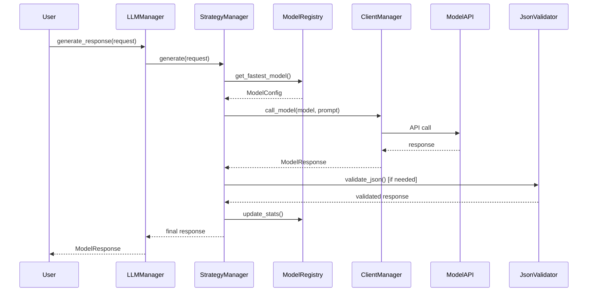
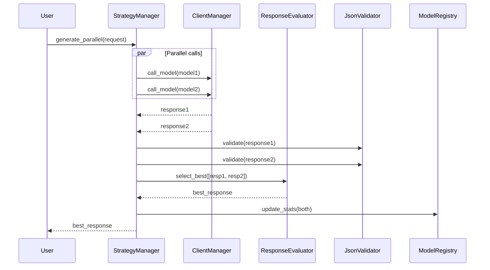

# Архитектура модуля LLM

## Обзор

Модуль LLM представляет собой полностью переработанную систему управления большими языковыми моделями с акцентом на модульность, надежность и расширяемость. Архитектура основана на принципах SOLID, dependency injection и разделении ответственностей.

## Архитектурные принципы

### 1. Модульность
- **7 специализированных компонентов** вместо монолитного класса
- **Единая ответственность** для каждого модуля
- **Четкие интерфейсы** между компонентами

### 2. Dependency Injection
- **Слабая связанность** между компонентами
- **Тестируемость** через mock объекты
- **Гибкость конфигурации** и замены реализаций

### 3. Fault Tolerance
- **Многоуровневые fallback цепочки**
- **Параллельное выполнение** для резервирования
- **Автоматический мониторинг** здоровья моделей

### 4. Производительность
- **Автоматический выбор** самых быстрых моделей
- **Параллельная генерация** для качества
- **Кэширование соединений** и оптимизации

## Компоненты архитектуры

### LLMManager (Фасад)

**Центральный компонент системы**

```python
class LLMManager:
    """
    Фасад для модульной архитектуры LLM

    Предоставляет единый интерфейс для:
    - Генерации ответов
    - Управления моделями
    - Мониторинга здоровья
    - Конфигурации системы
    """

    def __init__(self, config_path: str = "config/llm_settings.yaml"):
        # Инициализация всех компонентов через DI
        self.config_loader = ConfigLoader(config_path)
        self.registry = ModelRegistry(self.config_loader)
        self.client = ClientManager(self.config_loader)
        self.strategy = StrategyManager(self.registry, self.client, ...)
        self.evaluator = ResponseEvaluator(self.client)
        self.validator = JsonValidator()
        self.monitor = HealthMonitor(self.registry, self.client)

    async def generate_response(self, request: GenerationRequest) -> ModelResponse:
        """Единая точка входа для генерации ответов"""
        return await self.strategy.generate(request)
```

**Ответственности:**
- Управление жизненным циклом компонентов
- Dependency injection зависимостей
- Координация между компонентами
- Предоставление единого API

### ModelRegistry

**Управление реестром моделей и их конфигурацией**

```python
class ModelRegistry:
    """
    Реестр моделей с поддержкой ролей и статистики

    Управляет:
    - Конфигурацией моделей
    - Ролями моделей (PRIMARY, DUPLICATE, RESERVE, FALLBACK)
    - Статистикой производительности
    - Выбором оптимальных моделей
    """

    def get_models_by_role(self, role: ModelRole) -> List[ModelConfig]:
        """Получить все модели заданной роли"""

    def get_fastest_model(self, role: ModelRole = ModelRole.PRIMARY) -> Optional[ModelConfig]:
        """Получить самую быструю модель заданной роли"""

    def update_model_stats(self, model_name: str, success: bool, response_time: float):
        """Обновить статистику модели"""
```

**Ключевые функции:**
- Загрузка конфигурации из YAML
- Управление ролями моделей для fallback
- Сбор и анализ статистики производительности
- Автоматический выбор оптимальных моделей

### ClientManager

**Управление API клиентами для разных провайдеров**

```python
class ClientManager:
    """
    Менеджер API клиентов

    Отвечает за:
    - Создание и кэширование клиентов
    - Маршрутизацию запросов к провайдерам
    - Обработку сетевых ошибок
    - Управление аутентификацией
    """

    async def call_model(self, model: ModelConfig, prompt: str) -> ModelResponse:
        """Выполнить вызов модели через соответствующий клиент"""
```

**Поддерживаемые провайдеры:**
- OpenRouter (основной)
- OpenAI (дополнительный)
- Другие провайдеры через интерфейс

### StrategyManager

**Логика выбора и выполнения стратегий генерации**

```python
class StrategyManager:
    """
    Менеджер стратегий генерации

    Поддерживает стратегии:
    - Single Model: Быстрая генерация
    - Parallel Generation: Качество через параллельность
    - Fallback Chains: Надежность через резервирование
    """

    async def generate(self, request: GenerationRequest) -> ModelResponse:
        """Выбрать и выполнить подходящую стратегию"""
```

**Стратегии:**

#### Single Model Strategy
```python
async def _generate_single(self, request: GenerationRequest) -> ModelResponse:
    """Генерация через одну модель с fallback цепочкой"""
    # 1. Выбрать оптимальную модель
    # 2. Выполнить вызов
    # 3. При ошибке - fallback на резервные
    # 4. Вернуть результат
```

#### Parallel Strategy
```python
async def _generate_parallel(self, request: GenerationRequest) -> ModelResponse:
    """Параллельная генерация с выбором лучшего"""
    # 1. Запустить несколько моделей параллельно
    # 2. Оценить результаты
    # 3. Выбрать лучший ответ
    # 4. Вернуть результат
```

### ResponseEvaluator

**Оценка качества ответов моделей**

```python
class ResponseEvaluator:
    """
    Оценщик качества ответов

    Функции:
    - Сравнение нескольких ответов
    - Выбор оптимального ответа
    - Оценка по критериям качества
    """

    async def evaluate_response(self, prompt: str, response: str) -> float:
        """Оценить качество ответа (0-10)"""

    async def select_best_response(self, responses: List[ModelResponse]) -> ModelResponse:
        """Выбрать лучший ответ из списка"""
```

**Критерии оценки:**
- **Relevance**: Соответствие запросу
- **Completeness**: Полнота ответа
- **Accuracy**: Точность информации
- **Clarity**: Ясность и понятность

### JsonValidator

**Специализированная валидация JSON ответов**

```python
class JsonValidator:
    """
    Валидатор JSON ответов

    Обеспечивает:
    - Извлечение JSON из текста
    - Валидацию структуры
    - Исправление malformed JSON
    """

    def validate_and_extract(self, text: str) -> Tuple[bool, Any]:
        """Извлечь и провалидировать JSON"""
```

**Функции:**
- Извлечение JSON из markdown кода
- Валидация JSON схемы
- Исправление распространенных ошибок
- Типобезопасность ответов

### HealthMonitor

**Мониторинг здоровья моделей**

```python
class HealthMonitor:
    """
    Монитор здоровья моделей

    Выполняет:
    - Регулярные проверки моделей
    - Отключение проблемных моделей
    - Попытки восстановления
    """

    async def start_monitoring(self):
        """Запустить фоновый мониторинг"""

    async def check_health(self) -> Dict[str, str]:
        """Проверить здоровье всех моделей"""
```

**Возможности:**
- Автоматические health checks
- Отключение неработоспособных моделей
- Уведомления о проблемах
- Попытки восстановления после сбоев

### ConfigLoader

**Загрузка и валидация конфигурации**

```python
class ConfigLoader:
    """
    Загрузчик конфигурации

    Поддерживает:
    - Загрузку YAML файлов
    - Подстановку переменных окружения
    - Валидацию структуры
    """

    def load_config(self, path: str) -> Dict[str, Any]:
        """Загрузить и провалидировать конфигурацию"""
```

## Поток данных

### Базовая генерация (Single Model)



### Параллельная генерация (Best-of-Two)



## Конфигурация системы

### Структура конфигурационного файла

```yaml
llm:
  # Общие настройки
  default_provider: openrouter
  request_timeout: 200
  max_retries: 3

  # Компоненты
  components:
    health_monitor:
      enabled: true
      check_interval: 300
      failure_threshold: 3

    parallel_generation:
      enabled: true
      evaluator_model: meta-llama/llama-3.2-3b-instruct

  # Модели по ролям
  models:
    primary:
      - name: meta-llama/llama-3.2-1b-instruct
        provider: openrouter
        max_tokens: 4096
        temperature: 0.7
        enabled: true

    duplicate:
      - name: google/gemma-2-27b-it
        provider: openrouter
        max_tokens: 8192
        temperature: 0.8

    reserve:
      - name: mistralai/mistral-small-24b-instruct-2501
        provider: openrouter

    fallback:
      - name: meta-llama/llama-3.2-3b-instruct
        provider: openrouter

  # Провайдеры
  providers:
    openrouter:
      base_url: "https://openrouter.ai/api/v1"
      timeout: 200
      # API ключ из переменных окружения

  # Стратегии
  strategies:
    default: single_fastest
    json_mode: parallel_with_validation
```

## Интерфейсы и контракты

### Основные интерфейсы

```python
# src/llm/types.py

class IModelRegistry(Protocol):
    """Интерфейс реестра моделей"""
    def get_models_by_role(self, role: ModelRole) -> List[ModelConfig]: ...
    def get_model(self, name: str) -> Optional[ModelConfig]: ...
    def update_model_stats(self, name: str, success: bool, time: float) -> None: ...

class IClientManager(Protocol):
    """Интерфейс менеджера клиентов"""
    async def call_model(self, model: ModelConfig, prompt: str) -> ModelResponse: ...

class IStrategyManager(Protocol):
    """Интерфейс менеджера стратегий"""
    async def generate(self, request: GenerationRequest) -> ModelResponse: ...

class IResponseEvaluator(Protocol):
    """Интерфейс оценщика ответов"""
    async def evaluate_response(self, prompt: str, response: str) -> float: ...

class IJsonValidator(Protocol):
    """Интерфейс JSON валидатора"""
    def validate_and_extract(self, text: str) -> Tuple[bool, Any]: ...

class IHealthMonitor(Protocol):
    """Интерфейс монитора здоровья"""
    async def check_health(self) -> Dict[str, str]: ...

class IConfigLoader(Protocol):
    """Интерфейс загрузчика конфигурации"""
    def load_config(self, path: str) -> Dict[str, Any]: ...
```

## Обработка ошибок

### Многоуровневая стратегия

1. **Сетевые ошибки** (ClientManager)
   - Таймауты соединений
   - Повторные попытки
   - Fallback на другие endpoint'ы

2. **API ошибки** (StrategyManager)
   - Rate limiting
   - Invalid requests
   - Service unavailable

3. **Модельные ошибки** (ModelRegistry)
   - Модель не отвечает
   - Некорректный ответ
   - Fallback цепочки

4. **Валидационные ошибки** (JsonValidator)
   - Malformed JSON
   - Schema validation
   - Автоматическое исправление

## Тестирование

### Модульное тестирование

```python
# tests/test_llm_registry.py
@pytest.fixture
def mock_config_loader():
    return Mock(spec=IConfigLoader)

@pytest.fixture
def model_registry(mock_config_loader):
    return ModelRegistry(mock_config_loader)

def test_get_fastest_model(model_registry):
    # Тест выбора самой быстрой модели
    pass

def test_update_model_stats(model_registry):
    # Тест обновления статистики
    pass
```

### Интеграционное тестирование

```python
# tests/integration/test_llm_generation.py
@pytest.mark.asyncio
async def test_full_generation_flow(llm_manager):
    """Тест полного потока генерации"""
    request = GenerationRequest(prompt="Test prompt")

    response = await llm_manager.generate_response(request)

    assert response.success
    assert response.content
    assert response.model_name
```

## Производительность и оптимизации

### Метрики производительности

- **Response Time**: Среднее время ответа моделей
- **Success Rate**: Процент успешных запросов
- **Throughput**: Количество запросов в секунду
- **Error Rate**: Процент ошибок по моделям

### Оптимизации

1. **Connection Pooling**: Переиспользование соединений
2. **Smart Selection**: Выбор оптимальных моделей
3. **Parallel Execution**: Одновременные запросы
4. **Caching**: Кэширование часто используемых данных
5. **Health-based Routing**: Маршрутизация на здоровые модели

## Мониторинг и observability

### Метрики

```python
# Метрики для мониторинга
llm_requests_total = Counter('llm_requests_total', ['model', 'strategy'])
llm_response_time = Histogram('llm_response_time_seconds', ['model'])
llm_errors_total = Counter('llm_errors_total', ['model', 'error_type'])
llm_model_health = Gauge('llm_model_health', ['model'])
```

### Логирование

```python
# Структурированное логирование
logger.info("Model request", extra={
    'model': model_name,
    'strategy': strategy_name,
    'prompt_length': len(prompt),
    'request_id': request_id
})

logger.error("Model failed", extra={
    'model': model_name,
    'error': str(error),
    'fallback_attempt': attempt,
    'request_id': request_id
})
```

## Расширение системы

### Добавление нового провайдера

```python
# 1. Создать клиента для провайдера
class NewProviderClient:
    async def call(self, model: ModelConfig, prompt: str) -> ModelResponse:
        # Реализация API вызова
        pass

# 2. Зарегистрировать в ClientManager
client_manager.register_provider('new_provider', NewProviderClient())

# 3. Добавить в конфигурацию
providers:
  new_provider:
    base_url: "https://new-provider.api"
    api_key: "${NEW_PROVIDER_API_KEY}"
```

### Добавление новой стратегии

```python
# 1. Реализовать стратегию
class CustomStrategy:
    async def generate(self, request: GenerationRequest) -> ModelResponse:
        # Кастомная логика генерации
        pass

# 2. Зарегистрировать в StrategyManager
strategy_manager.register_strategy('custom', CustomStrategy())

# 3. Использовать в конфигурации
strategies:
  custom_tasks: custom
```

## Безопасность

### Защита API ключей

- Хранение в переменных окружения
- Валидация ключей перед использованием
- Ротация ключей без перезапуска

### Ограничения запросов

- Rate limiting на уровне провайдеров
- Ограничение количества одновременных запросов
- Защита от злоупотреблений

### Аудит и логирование

- Полное логирование всех запросов
- Аудит использования моделей
- Мониторинг подозрительной активности

## Заключение

Модульная архитектура LLM предоставляет надежную, расширяемую и высокопроизводительную систему для работы с большими языковыми моделями. Разделение на специализированные компоненты обеспечивает:

- **Надежность** через многоуровневые fallback механизмы
- **Производительность** через оптимизации и параллельное выполнение
- **Расширяемость** через интерфейсы и dependency injection
- **Поддерживаемость** через четкое разделение ответственностей
- **Тестируемость** через изолированные компоненты

Архитектура готова к будущему росту и легко адаптируется под новые требования и технологии.