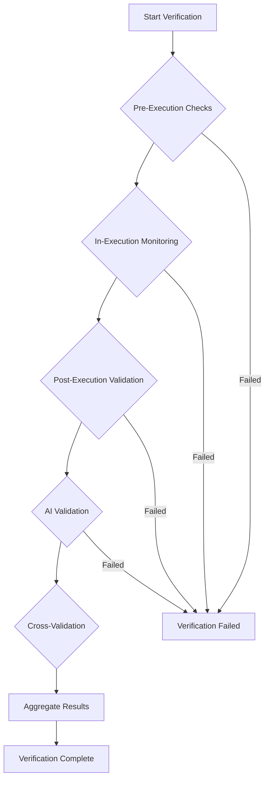

# Система многоуровневой верификации результатов

## Обзор

Система многоуровневой верификации результатов - это комплексный фреймворк для обеспечения качества и надежности выполнения задач в Code Agent. Система включает 5 уровней проверки: от предварительной валидации до AI-based анализа результатов.

## Архитектура

### Компоненты системы

#### 1. MultiLevelVerificationManager (`src/verification/verification_manager.py`)

Центральный компонент системы, координирующий все уровни верификации:

- **Функции:**
  - Запуск полного пайплайна верификации
  - Управление конфигурацией уровней
  - Агрегация результатов по уровням
  - Кросс-валидация между уровнями

**Основные методы:**
- `run_verification_pipeline()` - Запуск полного пайплайна
- `run_pre_execution_checks()` - Pre-execution проверки
- `run_in_execution_monitoring()` - In-execution мониторинг
- `run_post_execution_validation()` - Post-execution валидация
- `run_ai_validation()` - AI-based валидация
- `run_cross_validation()` - Кросс-валидация результатов

#### 2. ExecutionMonitor (`src/verification/execution_monitor.py`)

Компонент для мониторинга выполнения задач в реальном времени:

- **Функции:**
  - Отслеживание прогресса выполнения
  - Мониторинг системных ресурсов
  - Проверка здоровья выполнения
  - Обнаружение таймаутов и ошибок

#### 3. LLMValidator (`src/verification/llm_validator.py`)

AI-based валидация результатов с использованием языковых моделей:

- **Функции:**
  - Анализ качества кода через LLM
  - Валидация соответствия задаче
  - Генерация предложений по улучшению
  - Логическая валидация результатов

### Уровни верификации

#### Уровень 1: Pre-Execution Verification (Предварительная проверка)

**Назначение:** Валидация условий перед началом выполнения задачи

**Проверки:**
- **CoverageChecker**: Покрытие тестами (pytest-cov)
- **ComplexityChecker**: Цикломатическая сложность (radon/mccabe)
- **SecurityChecker**: Безопасность кода (bandit)
- **StyleChecker**: Стиль кода (ruff, mypy, bandit)
- **TaskTypeChecker**: Корректность типов задач
- **DependencyChecker**: Проверка зависимостей проекта
- **ResourceChecker**: Доступность системных ресурсов
- **ConfigurationChecker**: Корректность конфигурации

**Вес в общем скоре:** 20%

#### Уровень 2: In-Execution Monitoring (Мониторинг выполнения)

**Назначение:** Отслеживание выполнения задачи в реальном времени

**Проверки:**
- **ProgressChecker**: Прогресс выполнения
- **ResourceUsage**: Использование ресурсов
- **Timeout**: Контроль времени выполнения
- **ErrorPattern**: Обнаружение паттернов ошибок

**Вес в общем скоре:** 30%

#### Уровень 3: Post-Execution Validation (Пост-выполнение валидация)

**Назначение:** Валидация результатов после выполнения задачи

**Проверки:**
- **OutputValidation**: Валидация выходных данных
- **CodeChange**: Анализ изменений кода
- **TestExecution**: Выполнение тестов
- **Performance**: Оценка производительности

**Вес в общем скоре:** 30%

#### Уровень 4: AI Validation (AI-валидация)

**Назначение:** Интеллектуальный анализ результатов с использованием LLM

**Типы валидации:**
- **CodeQualityAI**: Анализ качества кода
- **LogicValidation**: Проверка логики
- **TaskCompliance**: Соответствие задаче

**Вес в общем скоре:** 20%

#### Уровень 5: Cross-Validation (Кросс-валидация)

**Назначение:** Проверка согласованности результатов между уровнями

**Анализ:**
- Сравнение скоров между уровнями
- Обнаружение несогласованностей
- Проверка целостности результатов

**Вес в общем скоре:** 0% (не влияет на общий скор)

## Модели данных

### QualityCheckType (Типы проверок)

```python
class QualityCheckType(Enum):
    # Pre-execution checks
    COVERAGE = "coverage"
    COMPLEXITY = "complexity"
    SECURITY = "security"
    STYLE = "style"
    TASK_TYPE = "task_type"
    DEPENDENCY = "dependency"
    RESOURCE = "resource"
    CONFIGURATION = "configuration"

    # In-execution checks
    PROGRESS = "progress"
    RESOURCE_USAGE = "resource_usage"
    TIMEOUT = "timeout"
    ERROR_PATTERN = "error_pattern"

    # Post-execution checks
    OUTPUT_VALIDATION = "output_validation"
    CODE_CHANGE = "code_change"
    TEST_EXECUTION = "test_execution"
    PERFORMANCE = "performance"

    # AI validation checks
    CODE_QUALITY_AI = "code_quality_ai"
    LOGIC_VALIDATION = "logic_validation"
    TASK_COMPLIANCE = "task_compliance"

    # Cross-validation
    CONSISTENCY_CHECK = "consistency_check"
```

### VerificationLevel (Уровни верификации)

```python
class VerificationLevel(Enum):
    PRE_EXECUTION = "pre_execution"
    IN_EXECUTION = "in_execution"
    POST_EXECUTION = "post_execution"
    AI_VALIDATION = "ai_validation"
    CROSS_VALIDATION = "cross_validation"
```

### QualityStatus (Статусы результатов)

```python
class QualityStatus(Enum):
    PASSED = "passed"
    FAILED = "failed"
    WARNING = "warning"
    ERROR = "error"
    SKIPPED = "skipped"
```

## Конфигурация

### Структура конфигурации

```yaml
verification:
  overall_threshold: 0.7  # Общий порог успешности

  levels:
    pre_execution:
      enabled: true
      weight: 0.2
      required_score: 0.7

    in_execution:
      enabled: true
      weight: 0.3
      required_score: 0.8

    post_execution:
      enabled: true
      weight: 0.3
      required_score: 0.75

    ai_validation:
      enabled: true
      weight: 0.2
      required_score: 0.6

    cross_validation:
      enabled: true
      weight: 0.0  # Не влияет на общий скор
      required_score: 0.0

  quality_gates:
    # Конфигурация quality gates (см. architecture.md)

  execution_monitor:
    # Конфигурация мониторинга выполнения

  llm_validator:
    # Конфигурация LLM валидации
```

## Интеграция с Quality Gates

Система верификации интегрируется с существующим Quality Gates Framework:

- **Общие чекеры:** CoverageChecker, ComplexityChecker, SecurityChecker, StyleChecker, TaskTypeChecker
- **Новые чекеры:** DependencyChecker, ResourceChecker, ProgressChecker
- **Расширенные метрики:** DependencyMetrics, ResourceMetrics, ProgressMetrics

## Рабочий процесс

### Полный пайплайн верификации



### Алгоритм взвешенного скоринга

Общий скор верификации рассчитывается как взвешенное среднее по уровням:

```
overall_score = (pre_score × 0.2) + (in_score × 0.3) + (post_score × 0.3) + (ai_score × 0.2)
```

### Логика успешности

Верификация считается успешной если:
- Все включенные уровни пройдены успешно
- Общий скор выше порога `overall_threshold`
- Нет критических ошибок (ERROR status)

## Мониторинг и метрики

### Метрики верификации

- **Уровень выполнения:** Количество завершенных уровней
- **Время выполнения:** Общее время верификации
- **Скор согласованности:** Cross-validation скор
- **Детальные метрики:** По каждому типу проверки

### Логирование

Система предоставляет подробное логирование:
- Начало/завершение каждого уровня
- Результаты отдельных проверок
- Ошибки и предупреждения
- Метрики производительности

## Расширение системы

### Добавление новых чекеров

1. **Создать класс чекера** наследующий `IQualityChecker`
2. **Добавить тип проверки** в `QualityCheckType`
3. **Зарегистрировать чекер** в `QualityGateManager`
4. **Обновить конфигурацию** в `config.yaml`

### Добавление новых уровней верификации

1. **Добавить уровень** в `VerificationLevel`
2. **Создать интерфейс** для уровня
3. **Реализовать обработчик** уровня
4. **Интегрировать** в `MultiLevelVerificationManager`
5. **Обновить веса** в алгоритме скоринга

## Безопасность и надежность

### Fallback механизмы

- **Graceful degradation:** При недоступности компонентов
- **Timeout protection:** Защита от зависаний
- **Error isolation:** Изоляция ошибок отдельных уровней
- **Resource limits:** Ограничение потребления ресурсов

### Валидация входных данных

- **Type checking:** Строгая типизация
- **Range validation:** Проверка диапазонов значений
- **Sanitization:** Очистка входных данных

## Производительность

### Оптимизации

- **Параллельное выполнение:** AI валидации разных типов
- **Кэширование результатов:** Предотвращение повторных проверок
- **Асинхронная обработка:** Неблокирующие операции
- **Resource pooling:** Переиспользование ресурсов

### Метрики производительности

- **Время выполнения:** По уровням и типам проверок
- **Потребление ресурсов:** CPU, память, диск
- **Throughput:** Количество проверок в единицу времени