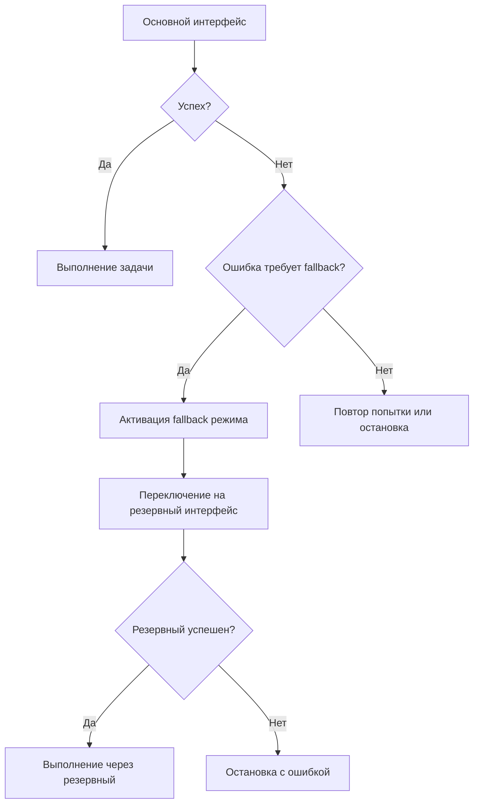

# Переключение CLI интерфейсов

## Обзор

Система Code Agent поддерживает несколько CLI интерфейсов для выполнения задач. Переключение между интерфейсами может осуществляться как через конфигурацию, так и через API во время работы сервера.

## Доступные CLI интерфейсы

### Cursor CLI (`cursor`)
- **Описание**: Интерфейс для работы с Cursor AI через официальный CLI
- **Особенности**:
  - Высокая производительность для сложных задач
  - Поддержка Docker контейнеров
  - Автоматическое управление сессиями
  - Fallback на резервные модели при ошибках

### Gemini CLI (`gemini`)
- **Описание**: Интерфейс для работы с Google Gemini через CLI агент
- **Особенности**:
  - Использует Google Gemini API
  - Требует GOOGLE_API_KEY
  - Подходит для задач анализа и генерации кода

### Hybrid Interface (`hybrid`)
- **Описание**: Комбинированный интерфейс, автоматически выбирающий оптимальный метод
- **Особенности**:
  - Автоматический выбор между CLI и файловым интерфейсом
  - Оптимизирован для разных типов задач
  - Graceful fallback при неудачах

## Конфигурация

### Опция cli_interface в config/llm_settings.yaml

```yaml
llm:
  cli_interface: cursor  # или "gemini"
```

**Параметры:**
- `cursor` - использовать Cursor CLI (по умолчанию)
- `gemini` - использовать Gemini CLI

**Пример конфигурации:**
```yaml
llm:
  cli_interface: gemini
  # ... остальные настройки LLM
```

## Настройка и использование

### 1. Настройка через конфигурационный файл

1. Откройте файл `config/llm_settings.yaml`
2. Найдите секцию `llm:`
3. Установите значение `cli_interface:`
4. Перезапустите сервер

```yaml
llm:
  cli_interface: cursor  # Для Cursor CLI
  # или
  cli_interface: gemini  # Для Gemini CLI
```

### 2. Runtime переключение через API

Сервер предоставляет API эндпоинт для переключения интерфейса без перезапуска:

```bash
curl -X POST http://localhost:3456/switch_cli_interface \
  -H "Content-Type: application/json" \
  -d '{"interface": "gemini"}'
```

**Успешный ответ:**
```json
{
  "success": true,
  "interface": "gemini",
  "previous_interface": "cursor",
  "message": "CLI интерфейс успешно переключен с cursor на gemini",
  "timestamp": "2026-01-26T19:15:00.000Z"
}
```

## Graceful Fallback механизм

### Автоматическое переключение при ошибках

Система автоматически переключается на резервный интерфейс при обнаружении определенных типов ошибок:

#### Типы ошибок, активирующие fallback:

1. **Billing errors** - проблемы с оплатой аккаунта
   - "unpaid invoice"
   - "pay your invoice"
   - "usage limit exceeded"

2. **Timeout errors** - превышение времени ожидания
   - Таймаут выполнения команды
   - Зависание процесса

3. **Model unavailable** - модель недоступна
   - Модель не найдена
   - API недоступен

4. **Unknown errors** - неизвестные ошибки
   - Неожиданные коды возврата
   - Системные ошибки

### Логика работы fallback:



### Автоматический billing fallback

При обнаружении проблем с оплатой система:
1. Активирует специальный billing fallback режим
2. Автоматически использует резервную модель для следующих запросов
3. Показывает предупреждения пользователю

```json
{
  "warning": "Обнаружена billing error - активирован автоматический fallback режим",
  "fallback_active": true,
  "next_requests_use_fallback": true
}
```

## API эндпоинт /switch_cli_interface

### Описание
Эндпоинт позволяет переключать CLI интерфейс во время работы сервера без перезапуска.

**URL:** `POST /switch_cli_interface`

**Content-Type:** `application/json`

### Параметры запроса

| Параметр | Тип | Обязательный | Описание |
|----------|-----|-------------|----------|
| `interface` | string | Да | Тип интерфейса: "cursor" или "gemini" |

### Примеры использования

#### Переключение на Gemini CLI

```bash
curl -X POST http://localhost:3456/switch_cli_interface \
  -H "Content-Type: application/json" \
  -d '{"interface": "gemini"}'
```

**Ответ:**
```json
{
  "success": true,
  "interface": "gemini",
  "previous_interface": "cursor",
  "message": "CLI интерфейс успешно переключен с cursor на gemini",
  "timestamp": "2026-01-26T19:15:00.000Z"
}
```

#### Переключение на Cursor CLI

```bash
curl -X POST http://localhost:3456/switch_cli_interface \
  -H "Content-Type: application/json" \
  -d '{"interface": "cursor"}'
```

#### Обработка ошибок

**Неверный интерфейс:**
```bash
curl -X POST http://localhost:3456/switch_cli_interface \
  -H "Content-Type: application/json" \
  -d '{"interface": "invalid"}'
```

**Ответ:**
```json
{
  "success": false,
  "error": "Недопустимый интерфейс \"invalid\". Допустимые: cursor, gemini"
}
```

**Отсутствие параметра:**
```bash
curl -X POST http://localhost:3456/switch_cli_interface \
  -H "Content-Type: application/json" \
  -d '{}'
```

**Ответ:**
```json
{
  "success": false,
  "error": "Параметр \"interface\" обязателен"
}
```

## Примеры использования

### Пример 1: Настройка через конфиг

```yaml
# config/llm_settings.yaml
llm:
  cli_interface: gemini
  # ... другие настройки
```

### Пример 2: Runtime переключение

```python
import requests

# Переключение на Gemini для задач анализа
response = requests.post(
    'http://localhost:3456/switch_cli_interface',
    json={'interface': 'gemini'}
)

if response.json()['success']:
    print("✓ Переключено на Gemini CLI")
```

### Пример 3: Проверка статуса интерфейса

```bash
# Проверка текущего статуса
curl http://localhost:3456/status

# Ответ содержит информацию о CLI интерфейсе
{
  "cli_interface": {
    "current": "cursor",
    "cursor_available": true,
    "gemini_available": false,
    "valid_interfaces": ["cursor", "gemini"]
  }
}
```

### Пример 4: Мониторинг fallback

```bash
# Проверка логов на предмет fallback событий
tail -f logs/code_agent.log | grep -i fallback

# Пример вывода:
# 2026-01-26 19:15:00 INFO 🔄 Fallback: cursor -> gemini
# 2026-01-26 19:15:05 INFO ✅ Fallback успешен: gemini
```

## Использование CLI интерфейсов для выполнения инструкций из туду листов других проектов

Сервер Code Agent может читать туду листы из других проектов и выполнять инструкции через CLI интерфейсы (cursor, gemini). Это позволяет:

- **Доступ к туду листам других проектов**: Сервер не ограничен текущим проектом и может читать туду листы из любых директорий, доступных в файловой системе.
- **Выполнение инструкций через CLI**: После чтения туду листа, сервер использует настроенный CLI интерфейс (cursor или gemini) для выполнения инструкций, описанных в задачах.
- **Автоматическое переключение интерфейсов**: Если один CLI интерфейс недоступен или возникает ошибка, система автоматически переключается на резервный интерфейс.

### Процесс работы

1. **Чтение туду листа**: Сервер сканирует указанную директорию проекта и находит файлы туду листов (например, `todo.md`, `plan.md`).
2. **Парсинг задач**: Извлекает задачи из туду листа и преобразует их в инструкции для выполнения.
3. **Выбор CLI интерфейса**: На основе конфигурации (`llm.cli_interface`) выбирается интерфейс для выполнения.
4. **Выполнение инструкции**: Инструкция передается в выбранный CLI интерфейс (cursor или gemini) для исполнения.
5. **Проверка результата**: После выполнения сервер проверяет результат и, при необходимости, вносит корректировки.

### Конфигурация

Для доступа к туду листам других проектов необходимо убедиться, что сервер имеет права на чтение соответствующих директорий. В конфигурации можно указать дополнительные пути:

```yaml
todo:
  external_projects:
    - path: /path/to/other/project
      todo_file: todo.md
```

### Пример

Предположим, в другом проекте есть туду лист `todo.md` со следующей задачей:

```markdown
- [ ] Добавить новую функцию в модуль `utils.py`
```

Сервер прочитает эту задачу, сформирует инструкцию и выполнит её через выбранный CLI интерфейс.

## Диагностика и устранение неполадок

### Проверка доступности интерфейсов

```bash
# Проверка статуса сервера
curl http://localhost:3456/health

# Проверка детального статуса
curl http://localhost:3456/status
```

### Распространенные проблемы

1. **Интерфейс недоступен**
   ```
   Решение: Проверьте наличие необходимых API ключей и установку CLI
   ```

2. **Ошибка переключения**
   ```
   Решение: Убедитесь, что новый интерфейс правильно настроен
   ```

3. **Fallback не работает**
   ```
   Решение: Проверьте логи на наличие ошибок инициализации резервного интерфейса
   ```

### Логи диагностики

```bash
# Просмотр логов переключения интерфейсов
grep "CLI интерфейс" logs/code_agent.log

# Просмотр логов fallback
grep "Fallback" logs/code_agent.log
```

## Советы по использованию

1. **Выбор интерфейса:**
   - Используйте `cursor` для сложных задач разработки
   - Используйте `gemini` для задач анализа и генерации

2. **Runtime переключение:**
   - Полезно для тестирования разных интерфейсов
   - Можно использовать в автоматизированных скриптах

3. **Мониторинг:**
   - Следите за логами на предмет fallback событий
   - Проверяйте статус через API для контроля доступности

4. **Производительность:**
   - Cursor CLI обычно быстрее для задач разработки
   - Gemini может быть эффективнее для аналитических задач